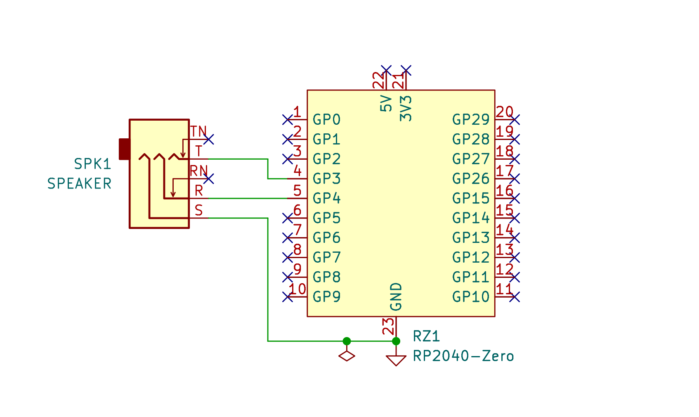

# Portable CPO

This is the support repository for the `Portable CPO` app. [Here is the link to
the `Portable CPO` app](https://play.google.com/store/apps/details?id=com.bunzee.portablecpo).

## Instructions

TLDR: Connect paddle key to GP3, GP4 and GND on the RP2040 board.

BOM:

- 3 jumper wires

- Raspberry Pi Pico or another RP2040 based board

- Morse Paddle of your choice

Build the following circuit. It will take less than 2 minutes.

Write the firmware to the RP2040 MCU board (contact `dhiru.kholia@gmail.com`
for the firmware file).

Next, connect the RP2040 MCU board to the Android phone via a USB cable (and an
OTG adapter).

Once these steps are done, launch the `Portable CPO` app and press the `Start`
button. Start keying next! ;)

## Testing Notes

The app is regularly tested on the following phones:

- Redmi Note 12 Pro running Android 13

- Redmi Note 7 Pro running Android 14

## Tested Paddles

- Paddle key from https://www.hamradioshop.in/

- Bencher BY-1 paddle

- https://www.printables.com/@AdamKimmerly (to be tested)

## Tested MCU boards

- Raspberry Pi Pico

- Waveshare RP2040-Zero

## Privacy Policy

This application is related to amateur radio communication. More specifically,
it is a local Morse Code practice / training application.

This app does NOT collect or send any data anywhere.
